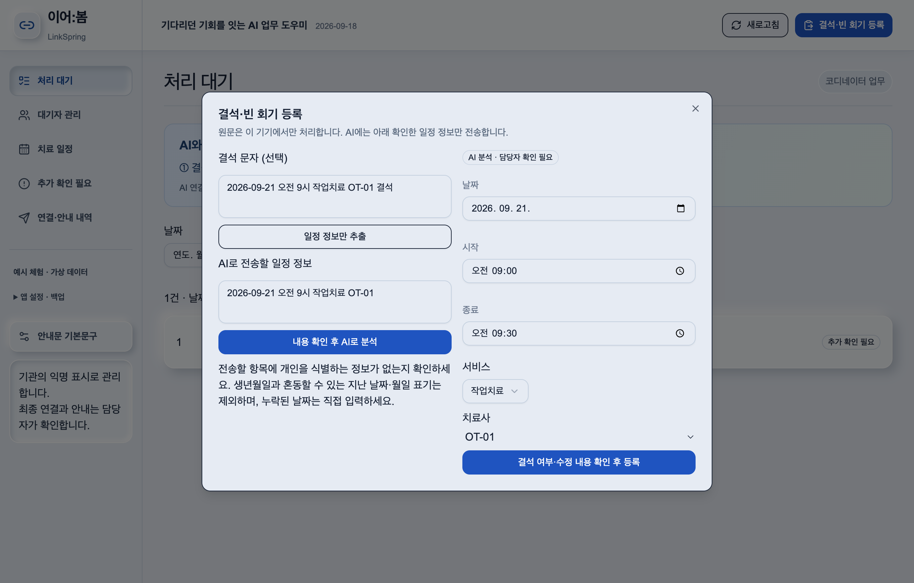
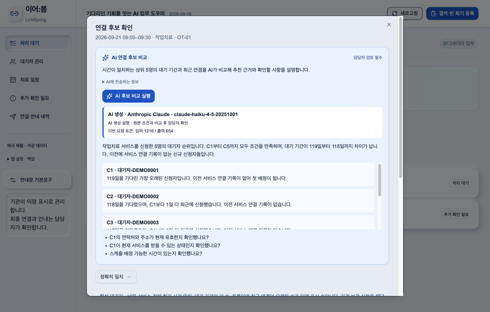
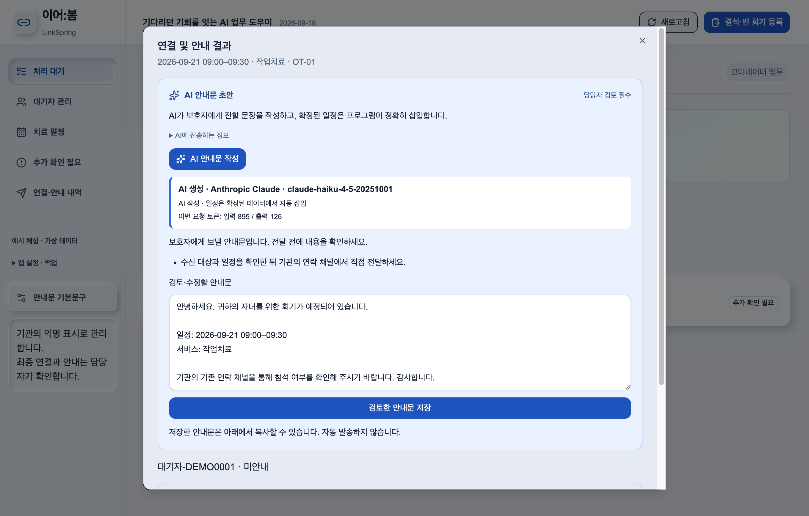
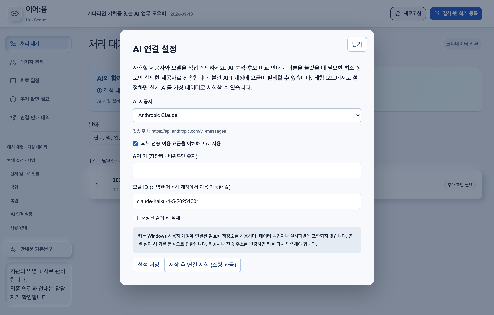
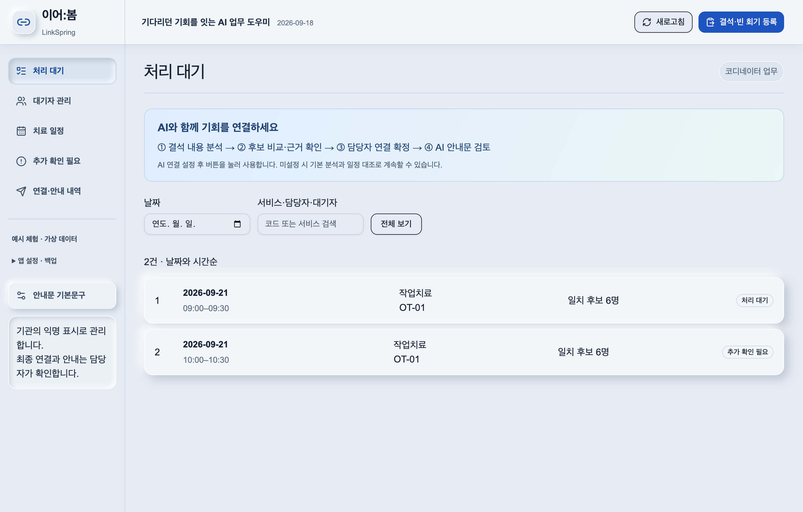
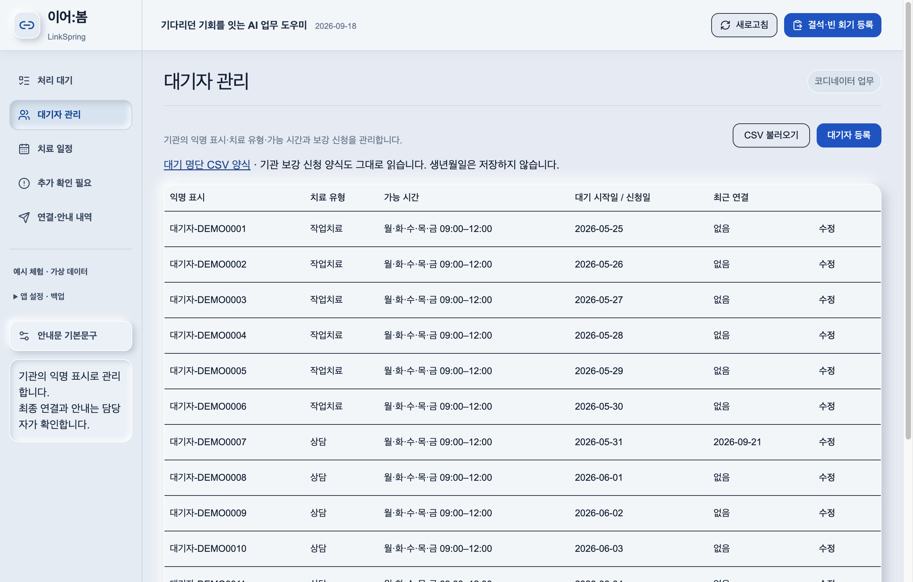
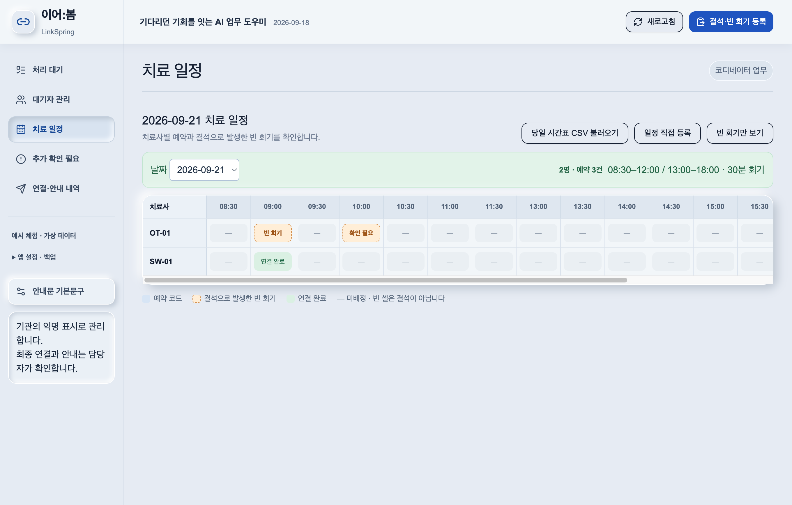
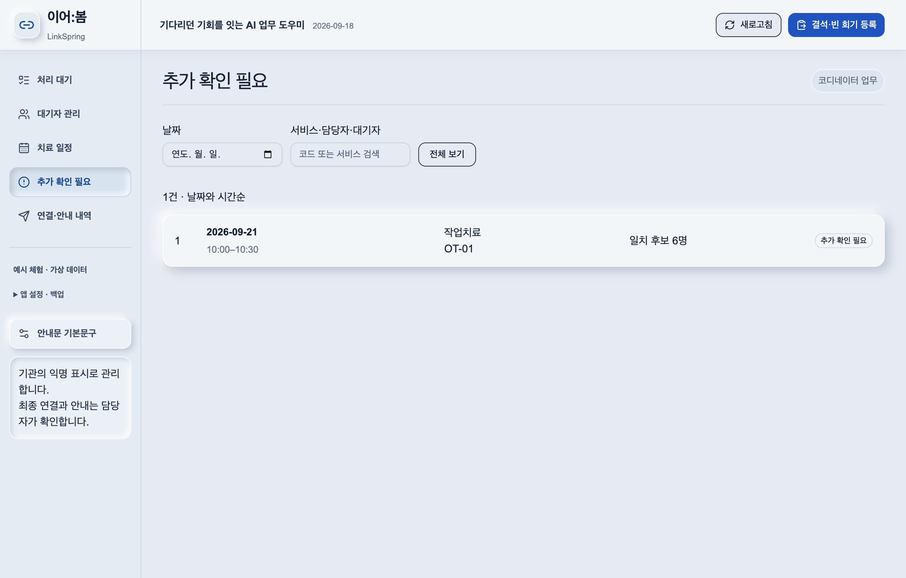
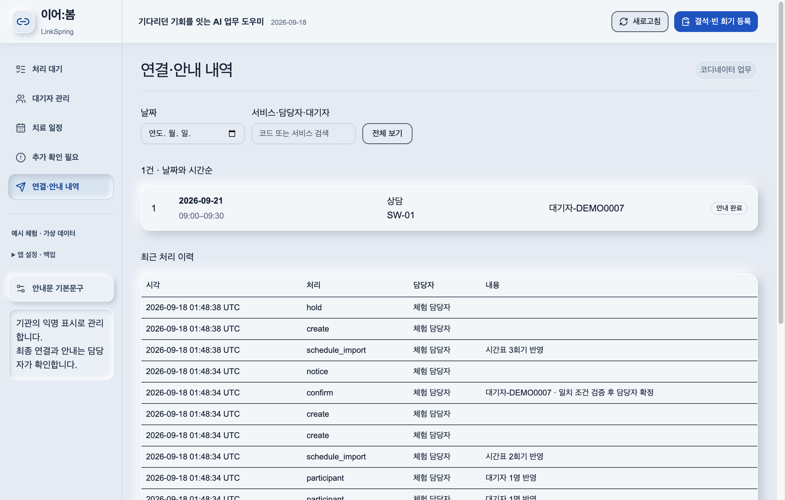

# 0. 이어:봄(LinkSpring)

**이어:봄은 AI가 결석 내용을 일정으로 정리하고, 연결 후보의 차이와 추천 근거를 설명하며, 보호자 안내문을 작성해 비영리 기관의 기다리던 기회를 이어주는 Windows 업무 프로그램입니다.**


### AI가 함께하는 업무 흐름 — 제출 버전 1.2.0

**결석 내용 AI 분석 → 일정 검증 → AI 후보 비교 → 담당자 연결 확정 → AI 안내문 검토·저장 → 실제 안내 완료 기록**

아래는 제출본과 같은 코드의 Electron 앱을 macOS 검증 환경에서 실행한 실제 화면입니다. 배포 대상은 **Windows 10/11 x64**입니다. 가상 데이터만 사용했고, AI 화면은 `claude-haiku-4-5-20251001` API의 실제 응답을 캡처했습니다. 개인정보나 API 키는 포함하지 않았습니다.

| AI 결석 분석 | AI 연결 후보 비교 |
| --- | --- |
|  |  |
| AI 안내문 검토·저장 | 사용자가 선택하는 AI 제공사 |
|  |  |

### 실제 프로그램의 다섯 메뉴

| 처리 대기 | 대기자 관리 |
| --- | --- |
|  |  |
| 치료 일정 | 추가 확인 필요 |
|  |  |
| 연결·안내 내역 |  |
|  |  |

**실행 방식:** Windows 설치파일 하나로 기본 업무와 가상 데이터 체험을 시작합니다. 실제 AI 기능에는 인터넷과 사용자가 선택한 제공사의 API 키가 필요합니다. 별도 웹 로그인이나 테스트 계정은 없습니다.

## 1. 팀 기본 정보

### 1.1 기관 정보

- **기관명:** 푸르메재단 넥슨어린이재활병원
- **기관 소개:** 푸르메재단 넥슨어린이재활병원은 시민 1만 명과 기업 500곳의 나눔, 정부와 지방자치단체의 지원으로 세워진 국내 최초의 통합형 어린이재활병원입니다. 통합 재활의료서비스를 통해 어린이의 잠재력을 이끌어내고 가족과 사회에 희망을 나누는 것을 지향합니다. 출처: [푸르메재단 재활의료사업](https://purme.org/rehabilitation)

### 1.2 팀 구성원 정보

1인 팀으로 문제 정의, 사용자 흐름 설계, 구현, 검증과 제출 문서 작성을 수행했습니다.

| 구분 | **이름** | **소속·직책** | **AI 챌린지 해에서의 담당 역할** |
| --- | --- | --- | --- |
| 팀장 | 제출자 (1인 개발팀) | 푸르메재단 넥슨어린이재활병원 | 현장 문제 정의, 업무 규칙·사용자 흐름 설계, 데이터 구조 설계, 기능 구현, 테스트와 제출 문서 작성 전반 |
| 팀원 | 없음 | 1인 팀 | 해당 없음 |

## 2. AI 솔루션

### 2.1 문제 정의

치료뿐 아니라 상담, 교육, 가족지원 등 다양한 사회사업에는 대기 명단이 존재합니다. 현재 서비스를 이용하는 대상자가 당일 결석 의사를 기관에 전달하면, 담당자는 대기자의 가능 시간과 기관의 가용 일정을 대조해야 합니다. 치료 일정의 경우 담당자가 약 100명의 스케줄을 수동으로 살펴보며 새로운 치료 기회를 연결해야 할 수 있습니다.

주 이용자는 빈 회기와 사업 일정을 관리하는 기관 코디네이터입니다. 기존에는 전화, 사내 메신저와 별도 명단을 오가며 대기자별 가능 시간을 확인했습니다. 이 과정이 반복되면 기다리는 사람에게 기회가 이어지기 전에 시간이 소진될 수 있고, 후보 선정 기준과 처리 이력이 담당자마다 달라질 수 있습니다. 안내 완료 여부를 별도로 확인해야 하므로 누락이나 중복 확인도 발생할 수 있습니다.

이어:봄은 이 문제를 ‘빈 스케줄을 채워 수익을 높이는 일’이 아니라 ‘기다리던 사람에게 이미 생긴 서비스 기회를 공정하고 빠르게 이어주는 일’로 다시 정의했습니다.

### 2.2 AI 솔루션 소개

#### 솔루션 개요

이어:봄은 Windows 10/11 64비트 PC에 설치하는 로컬 데스크톱 프로그램입니다. 현재는 치료 일정을 중심으로 구현했으며, 같은 구조를 상담·교육·가족지원 등 비영리 기관의 다른 서비스 일정으로 확장할 수 있도록 치료 유형과 일정 규칙을 분리해 설계했습니다.

1. 기관의 익명 치료사 시간표와 보강치료 신청 CSV를 로컬에서 읽고, 저장 전에 행·열 오류와 반영 내용을 보여줍니다.
2. 치료사 행과 시간 열로 구성된 현황판에서 예약 상태를 확인하고, 실제 결석이 확인된 회기만 빈 회기로 등록합니다.
3. 서비스 유형, 희망 날짜, 30분 전체 가능 시간, 활성 상태와 기존 연결을 검사해 후보를 제시합니다.
4. 대기 기간이 긴 순, 최근 연결이 오래된 순, 익명 표시 순으로 후보를 정렬하되 자동 확정하지 않습니다.
5. 코디네이터가 최종 대기자를 선택하고, 연결 결과와 실제 안내 완료를 각각 기록합니다.
6. AI가 결석 안내에서 추린 일정 표현을 날짜·시간·서비스·치료사 항목으로 구조화합니다. 담당자는 전송할 정보와 분석 결과를 확인하고 수정합니다.
7. AI가 검증된 상위 후보의 대기 기간과 최근 연결을 비교하고, 추천 근거와 담당자가 확인할 사항을 설명합니다. 연결 자격과 순위는 명시된 업무 규칙으로 검증합니다.
8. AI가 보호자 안내문을 작성합니다. 확정된 날짜·시간·서비스는 프로그램이 삽입하며, 담당자가 문구를 검토·수정해 저장한 뒤 직접 안내합니다.

#### 솔루션 사용 링크

| **구분** | **링크 또는 안내** | **상태** |
| --- | --- | --- |
| 솔루션 실행 링크 | [GitHub 배포 페이지](https://github.com/hamhyeonggwang/linkspring_1.0/releases) · 파일명 `LinkSpring-Setup-1.2.0-x64.exe` | 1.2.0 설치파일은 제출 묶음에 포함. 온라인 자산 게시 여부는 배포 페이지에서 확인 |
| 소스코드 또는 결과물 원본 | [GitHub 저장소](https://github.com/hamhyeonggwang/linkspring_1.0) | 소스코드 ZIP은 설치파일이 아님 |
| 데모 영상(선택) | 별도 영상 없음. 0번의 실제 실행 화면과 가상 데이터 체험 제공 | 선택 항목 |
| 테스트 계정(선택) | 필요 없음. 웹 계정이 없는 Windows 로컬 설치형이며 첫 실행의 `예시로 체험`에서 가상 데이터로 확인할 수 있습니다. | 준비됨 |

#### 설치 및 실행 방법

이용자는 별도의 Node.js, Python, 웹 서버나 클라우드 계정 없이 설치파일만으로 기본 기능을 사용할 수 있습니다.

1. 제출 묶음 또는 GitHub Release에서 `LinkSpring-Setup-1.2.0-x64.exe`를 Windows 10/11 64비트 PC로 다운로드합니다.
2. 설치파일을 실행해 현재 Windows 사용자 계정에 설치합니다.
3. 바탕화면 또는 시작 메뉴에서 **이어봄 LinkSpring**을 실행합니다.
4. 처음에는 **예시로 체험**을 선택해 가상 대기자와 빈 회기로 전체 흐름을 확인합니다.
5. **실제 업무 시작**으로 전환한 뒤 기관에서 승인한 익명 CSV만 불러옵니다.
6. 실제 AI를 사용하려면 **앱 설정 · 백업 → AI 연결 설정**에서 제공사, 모델 ID와 본인 API 키를 저장합니다. **저장 후 연결 시험**으로 확인한 후 각 AI 버튼을 누릅니다. 체험 모드에서도 실제 AI 호출이 가능하며 본인 API 계정에 요금이 발생할 수 있습니다.

현재 설치파일은 코드 서명되지 않았습니다. Windows가 확인되지 않은 게시자로 표시할 수 있으므로 기관의 실행 정책에 따라 설치해야 합니다. 자세한 절차는 [Windows 사용 안내](docs/Windows_사용안내.md)에 정리했습니다.

#### 주요 기능

- **기관 CSV 미리보기:** 대기명단과 치료사 시간표를 UTF-8 또는 EUC-KR CSV로 읽고, 잘못된 행·열과 반영 건수를 저장 전에 확인합니다.
- **안정적인 익명 식별:** 기관의 익명 표시와 앱 내부 ID를 분리합니다. 같은 파일을 다시 불러와도 기존 중지 상태, 완료 상태, 최근 연결과 내부 ID를 유지합니다.
- **치료 일정 현황판:** 치료사별 예약 코드, 미배정 시간, 결석으로 생긴 빈 회기와 연결 완료 상태를 시간표에서 구분합니다.
- **결석 회기 등록:** 시간표의 예약 칸에서 실제 결석 여부를 확인한 후에만 빈 회기로 등록합니다. 단순한 빈 셀은 결석으로 처리하지 않습니다.
- **후보 계산과 근거 표시:** 희망 날짜·서비스·가능 시간·대기 기간·최근 연결을 비교하고, 현재 회기와 정확히 맞는 후보만 확정할 수 있게 합니다.
- **사람의 최종 결정:** 시스템은 후보를 제시하지만 자동 연결하지 않습니다. 담당자가 확정하거나 `추가 확인 필요`로 보류합니다.
- **안내 및 이력 관리:** 개인정보가 없는 안내문을 복사한 뒤 기관 채널에서 직접 전달하고, 실제 안내 완료 여부를 별도로 기록합니다.
- **로컬 저장과 백업:** 업무 데이터와 체험 데이터를 PC의 서로 다른 SQLite 파일에 저장하며, 백업·복원과 이전 1.0.0 백업의 검증된 업그레이드를 지원합니다.
- **AI 결석 분석:** 상대 날짜와 시간 표현을 입력 항목으로 정리하고 담당자가 검토합니다.
- **AI 후보 비교:** 자격 검증을 통과한 상위 5명의 차이·추천 근거·확인 사항을 설명합니다.
- **AI 안내문 작성:** 보호자에게 전달할 초안을 검토·수정·저장하고, 사용한 초안 유형과 처리 이력을 남깁니다.
- **AI 제공사 선택과 비용 확인:** Anthropic Claude, OpenAI, Google Gemini, OpenAI 호환 API를 선택하며 모델 ID를 직접 입력합니다. 후보 비교·안내문 응답에 실제 제공사·모델·입출력 토큰을 표시합니다. 기본 업무는 인터넷이나 API 키 없이 동작합니다.

#### AI 활용 내용

| **구분** | **내용** |
| --- | --- |
| 사용한 AI 도구·모델 | Anthropic Messages와 OpenAI Chat Completions 형식의 함수 호출 어댑터. OpenAI·Gemini·호환 API 선택 지원. 실제 호출 및 화면 검증 모델은 Claude Haiku 4.5 (`claude-haiku-4-5-20251001`). 사용자가 다른 함수 호출 지원 모델로 변경 가능. OpenAI·Gemini·임의 호환 서버는 모의 응답 계약 테스트를 통과했으며 실제 계정별 호환성은 연결 시험으로 확인해야 함. |
| AI가 담당하는 기능 | 결석 표현의 구조화, 검증된 후보 간 차이와 추천 근거 설명, 확인 질문 생성, 보호자 안내문 초안 작성. |
| AI를 활용한 이유 | 담당자가 문장에서 정보를 옮기고, 여러 후보의 조건을 설명하고, 안내 문구를 다시 쓰는 반복 업무를 줄이기 위해 활용. 기존 치료사×시간 현황판에서 AI 결과를 바로 검토하도록 구성. |
| AI가 없었다면 어려웠던 부분 | 다양한 상대 날짜 표현 해석과 후보별 상황 설명·안내문 작성에 수작업 또는 많은 고정 문구가 필요. AI는 이를 문맥에 맞게 초안으로 만들고 담당자는 검토에 집중. API가 없어도 기본 분석·고정 안내문으로 업무를 계속할 수 있음. |

#### (선택) AI 성능 개선 시도

1. **입력 최소화:** 결석 분석에는 확인한 일정 토큰만 보냅니다. 후보 비교는 요청마다 만든 `C1~C5`와 대기·최근 연결 일수만 사용하고 실제 기관 식별자는 PC에서 연결합니다. 안내문 생성에는 실제 일정도 보내지 않습니다.
2. **검증 가능한 응답:** 함수 호출 구조를 검증하고, 후보 누락·중복·임의 번호·순위 변경을 거부합니다. 안내문 날짜·시간·서비스는 확정 데이터에서 삽입하며, 문구 저장 시 필수 일정이 남아 있는지 재검증합니다. 설명의 의미 정확성은 담당자가 원본과 비교합니다.
3. **비용과 실패 처리:** 버튼을 누를 때만 요청하고 자동 재시도하지 않습니다. 응답 토큰 상한과 25초 제한을 두며 실패하면 기본 결과로 전환합니다. 화면에 `AI 생성`과 `기본 결과 · AI 미사용`을 구분합니다.

가상 데이터로 실제 AI 후보 비교·안내문 생성·결석 분석과 UI 저장 흐름을 확인했습니다. 이는 표본 기능 검증이며, 기관 현장 정확도나 업무 시간 절감률을 측정한 결과는 아닙니다.

### 2.3 이용자용 가이드

#### 이용 전 준비

- Windows 10/11 64비트 PC와 설치파일을 준비합니다.
- 기관 내부 기준에 따라 개인정보를 제거하고 사람마다 구별되는 익명 표시가 포함된 CSV를 준비합니다.
- 기본 기능에는 인터넷과 API 키가 필요하지 않습니다. 실제 AI는 외부 전송을 확인하고 이용자가 제공사·모델·키를 설정한 경우에 사용합니다.

#### 실제 이용 순서

1. 첫 실행에서 **예시로 체험**을 선택해 가상 데이터로 전체 흐름을 연습합니다.
2. **치료 일정**에서 익명화된 치료사 시간표 CSV를 불러오고 날짜, 치료사, 예약 건수와 시간 열 해석을 확인한 뒤 반영합니다.
3. **대기자 관리**에서 보강치료 신청 CSV를 불러옵니다. 익명 표시, 희망 날짜, 치료 종류, 오전·오후 가능 시간과 처리 상태를 확인합니다.
4. 실제 결석이 발생하면 치료 일정의 해당 예약 칸을 선택하거나 **결석·빈 회기 등록**에서 날짜·시간·서비스·치료사를 확인해 등록합니다.
5. **처리 대기 → 회기 선택 → AI 후보 비교 실행**에서 비교 설명과 확인 사항을 읽습니다. 아래 후보 목록의 원본 조건과 비교한 뒤 선택하거나 `추가 확인 필요`로 보류합니다.
6. 담당자가 최종 연결을 확정합니다. **AI 안내문 작성 → 검토·수정 → 검토한 안내문 저장** 후 문구를 복사해 기존 연락 채널로 전달하고 **실제 안내 완료로 기록**합니다.
7. 업무 종료 전 왼쪽 아래 **앱 설정·백업**에서 `.sqlite` 백업을 접근이 제한된 장소에 저장합니다.

#### 이용 시 주의사항

- CSV의 `아동이름` 열은 실제 이름이 아니라 사람마다 고유하고 재추출 후에도 유지되는 익명 표시여야 합니다. 동일한 표시를 여러 사람에게 사용하면 앱에서 구별할 수 없습니다.
- 생년월일은 내부 ID 생성이나 저장에 사용하지 않으며 비고 원문도 저장하지 않습니다.
- 시간표의 빈 셀은 미배정 시간일 뿐 결석이 아닙니다. 실제 결석을 확인한 후 등록해야 합니다.
- 현재 운영 규칙은 08:30~18:00, 점심시간 12:00~13:00 제외, 30분 회기입니다.
- 확정 연결을 취소하는 화면은 아직 없으므로 최종 확정 전에 대기자와 회기 정보를 다시 확인합니다.
- 앱은 전화나 문자를 자동 발송하지 않습니다.

### 2.4 관리자용 가이드

#### 작동 구조

- **데스크톱 실행:** Electron이 Windows 앱과 로컬 화면을 실행합니다.
- **사용자 화면:** React 기반 UI에서 치료 일정, 대기자, 후보와 안내 이력을 관리합니다.
- **업무 규칙:** 날짜·회기·후보 검증과 CSV 해석은 TypeScript 코드에서 수행합니다.
- **데이터 저장:** Electron에 포함된 `node:sqlite`를 사용하며 업무 DB와 체험 DB를 분리합니다.
- **AI 연결:** Electron 메인 프로세스의 공통 어댑터가 사용자가 선택한 제공사에 최소 정보만 요청합니다. 후보 자격·순위·확정 검증은 로컬에서 수행하고, AI는 해석·비교 설명·안내문 초안을 제공합니다.

업무 데이터는 `%LOCALAPPDATA%\LinkSpring\data\linkspring.sqlite`, 체험 데이터는 같은 폴더의 `demo.sqlite`에 저장됩니다. API 키는 Windows 사용자 계정의 보안 저장 기능으로 암호화한 별도 설정 파일에 보관하며 업무 백업에는 포함하지 않습니다.

#### 설치·운영 준비

1. GitHub Release의 설치파일과 `SHA256SUMS.txt`를 함께 배포합니다.
2. Windows PC에서 해시를 확인하고 설치·실행·제거를 실제로 검수합니다.
3. 기관의 Windows 계정, 화면 잠금과 파일 접근 정책을 적용합니다. 앱 자체에는 별도 기관 로그인 기능이 없습니다.
4. 실제 사용 전에 기관 CSV의 시간 열, 익명 표시의 고유성과 재추출 시 유지 여부를 가상 또는 승인된 비식별 자료로 확인합니다.
5. 데이터·백업 보존기간, 보관 위치와 폐기 절차를 기관 정책으로 정합니다. SQLite DB와 백업은 자체 암호화되지 않습니다.
6. AI 사용 시 제공사·전송 주소, 외부 전송 승인, API 이용 계정과 비용을 확인합니다. 함수 호출 지원 모델을 선택하고 앱의 연결 시험을 수행합니다.

#### 유지보수와 검증

개발 환경에서는 Node.js 22.13 이상에서 다음 명령으로 검증합니다.

```bash
npm ci
npm run typecheck
npm test
npm run desktop:test
npm run lint
npm run desktop:build
npm run desktop:dist
npm run desktop:verify
```

1.2.0은 기존 업무 테스트 20개와 데스크톱·AI 테스트 22개를 통과했습니다. 실제 Electron에서 기관 형식 CSV와 전체 연결·안내 흐름, 실제 Claude API를 검증했습니다. Windows 설치파일의 구조 검증과 macOS Electron 실행 검증은 Windows PC의 실제 설치·실행·제거 검증과 구분합니다. 상세 기록은 [1.2.0 제출본 검증](docs/제출본_1.2.0_검증.md)에 정리했습니다.

## 3. 임팩트 계획서

### 3.1 현장 적용 결과

현재 확인된 결과는 실제 기관 이용자를 대상으로 한 현장 성과가 아니라 가상 데이터 기반의 기술 검증입니다. 기관 실제 CSV와 개인정보는 테스트에 사용하지 않았습니다.

| 확인 항목 | 현재 결과 |
| --- | --- |
| 핵심 업무 규칙과 저장 테스트 | 기존 단위·업무·로컬 D1 테스트 20개 통과 |
| 데스크톱 저장·백업·기관 CSV·AI | 테스트 22개 통과 |
| 실제 AI 호출 | 가상 데이터의 후보 비교·안내문 생성·결석 분석을 Claude Haiku 4.5로 실행 |
| 화면 업무 흐름 | CSV 오류 미반영, 미리보기, 반복 반영, 결석 등록, 후보 선택, 연결 확정과 안내 완료 검증 |
| 데이터 유지 | 앱 재시작, 현재 백업 복원, 1.0.0 백업 업그레이드와 복원 검증 |
| 설치 산출물 | Windows x64 NSIS 설치파일 생성 및 패키지 허용 목록 검사 |

실제 기관 적용 기간·연결 건수·시간 절감률·담당자 후기는 아직 확보하지 않았습니다. 현장 적용 시 동일한 업무의 처리 시간, 기회 연결 건수, 안내 누락, 코디네이터 의견을 비식별 형태로 측정할 계획입니다.

### 3.2 시행착오와 개선

첫 구현은 웹앱 형태였지만 공모전의 ‘다운로드 후 누구나 쉽게 이용’ 조건에 맞추려면 서버, Node.js와 개발 환경을 별도로 준비해야 했습니다. 이를 Windows 로컬 설치형 앱으로 바꾸어 설치파일 하나로 기본 업무를 시작하고, 실제 업무와 가상 체험 데이터를 분리하도록 개선했습니다.

로컬 앱으로 전환하는 과정에서 기존의 치료사×시간 현황판 UI가 단순한 일정 목록으로 바뀌고, 실제 기관 CSV가 기존 표준 형식과 맞지 않아 불러올 수 없는 문제가 발생했습니다. 특히 익명 처리된 신청 파일에도 별도의 `가명 ID`를 요구했습니다. 이를 다음과 같이 수정했습니다.

- 기존 치료사 행×시간 열 현황판과 대기자 관리 흐름을 복원했습니다.
- 기관의 대기명단 8개 열과 `Unnamed, 일자, 요일, 부서, 아이디, 치료사, 건수`로 시작하는 시간표를 직접 읽도록 했습니다.
- 기관의 익명 표시와 앱 내부 ID를 분리해 별도 가명 ID 열 없이도 가져오고 반복 반영 시 같은 대상으로 연결합니다.
- 생년월일과 비고 원문은 저장하지 않고, 모르는 치료·상태 표현은 담당자가 미리보기에서 확인하도록 했습니다.
- CSV 반영을 전체 성공 또는 전체 취소로 처리하고, 이미 등록한 결석·연결 기록이 사라지는 시간표 교체를 거부합니다.
- 1.0.0 백업을 신뢰된 이전 스키마로 검증하고 임시 DB에서 업그레이드한 뒤 복원하도록 했습니다.

남은 한계는 실제 Windows PC와 기관 실제 CSV를 이용한 현장 검수, 확정 연결 취소 기능, 여러 PC 동기화, EMR·문자 발송 연동과 실제 업무 시간 절감 측정입니다.

AI 역할이 결석 입력에만 머물러 업무 기여가 잘 드러나지 않는다는 피드백도 반영했습니다. 1.2.0에서는 후보 비교와 안내문 초안을 업무 화면에 넣고, Claude에 한정됐던 설정을 제공사·모델 선택 방식으로 바꾸었습니다. 생성 결과의 출처와 토큰 사용량을 표시하고, 검토한 안내문만 저장하도록 했습니다.

### 3.3 향후 계획 및 임팩트 확산

1. Windows 10/11 PC에서 설치, 실행, 업데이트와 제거를 검수하고 기관 보안 정책에 맞는 배포 절차를 확정합니다.
2. 기관이 승인한 비식별 CSV로 시간 열과 익명 표시의 안정성을 대조하고, 오류 유형을 반영합니다.
3. 일정 1건당 후보 확인 시간, 연결률, 안내 완료율과 보류 사유를 개인정보 없이 측정합니다.
4. 연결 취소·수정, 보존기간별 정리와 운영자용 복구 절차를 추가합니다.
5. 제공사별 AI 구조화·설명·안내문의 품질과 비용을 실제 업무 표본으로 비교하고, 오류 유형을 기록합니다. 사람의 최종 승인과 규칙 기반 후보 검증은 유지합니다.
6. 치료에서 확인한 데이터 구조를 상담, 교육, 가족지원과 지역사회 프로그램으로 확장합니다. 성과 기준은 빈 일정의 수익화가 아니라 대기 기간 단축과 기회 접근성 향상으로 둡니다.

## 4. 제출 전 최종 점검

### 4.1 외부 지원 범위

| **참여자** | **직접 수행하거나 지원한 내용** |
| --- | --- |
| 팀 | 1인 팀이 현장 문제 정의, 업무 규칙·사용자 흐름 설계, 구현 방향 결정, 기능 검증과 제출 문서 작성 수행 |
| 코치 | 현종혁 (코치 참여. 세부 코칭 내용은 본 문서에 별도로 기재하지 않음) |
| 외부 전문가·개발자 | 없음 |
| 기타 | 1인 개발팀이 생성형 AI 코딩 도구를 구현·검토 보조에 사용했고, 최종 요구사항과 결과는 팀이 확인했습니다. |

### 4.2 외부 자료 및 오픈소스 사용 내역

| **자료·프로그램명** | **사용 목적** | **출처** | **라이선스** |
| --- | --- | --- | --- |
| Electron | Windows 데스크톱 앱 실행·패키징 | [electronjs.org](https://www.electronjs.org/) | MIT |
| React, React DOM | 사용자 화면 구성 | [react.dev](https://react.dev/) | MIT |
| Vite, esbuild | 데스크톱 화면 빌드·번들링 | [vite.dev](https://vite.dev/), [esbuild.github.io](https://esbuild.github.io/) | MIT |
| Zod | 입력값과 AI 응답 스키마 검증 | [zod.dev](https://zod.dev/) | MIT |
| Radix UI | 대화상자·선택 UI의 접근성 기반 컴포넌트 | [radix-ui.com](https://www.radix-ui.com/) | MIT |
| Lucide React | 화면 아이콘 | [lucide.dev](https://lucide.dev/) | ISC |
| SQLite / `node:sqlite` | 로컬 업무 데이터 저장 | [sqlite.org](https://www.sqlite.org/) | Public Domain |
| Anthropic Claude Messages API | 결석 분석·후보 비교·안내문 생성, 실제 호출 검증 | [Anthropic 함수 호출 문서](https://platform.claude.com/docs/en/agents-and-tools/tool-use/define-tools) | 제공사 API 이용약관 |
| OpenAI Chat Completions API | 함수 호출 어댑터 | [OpenAI API 문서](https://developers.openai.com/api/reference/resources/chat) | 제공사 API 이용약관 |
| Google Gemini 호환 API | 제공사 선택 어댑터 | [Google 공식 호환 문서](https://ai.google.dev/gemini-api/docs/openai) | 제공사 API 이용약관 |
| 푸르메재단 기관 소개 | 제출 문서의 기관 소개 근거 | [푸르메재단 재활의료사업](https://purme.org/rehabilitation) | 링크·요약 인용 |

배포본에 포함된 패키지별 상세 라이선스는 설치파일의 `THIRD-PARTY-NOTICES.txt`에 함께 제공합니다.

### 4.3 체크리스트

- [X] 솔루션의 핵심 기능이 실제로 작동합니다. *(가상 데이터 자동 테스트와 Electron UI 흐름 기준)*
- [ ] 솔루션 실행 링크와 데모 영상(선택)을 확인했습니다. *(GitHub Release 링크 게시 후 최종 확인 필요)*
- [X] 이용자용 활용 가이드를 작성했습니다.
- [X] 관리자용 설치·운영 가이드를 작성했습니다.
- [X] 처음 보는 사람도 이해할 수 있도록 작성했습니다.
- [ ] 현장 적용 결과와 확인 가능한 근거를 작성했습니다. *(실제 현장 자료 입력 필요)*
- [X] 시행착오와 개선 과정을 작성했습니다.
- [X] 팀원과 외부 지원자의 역할을 구분하여 작성했습니다. *(1인 개발팀, 외부 전문가·개발자 없음, 코치 현종혁)*

### 4.4 개인정보 및 보안 확인

- [X] 개인정보 및 민감정보가 포함된 원본 데이터를 업로드하지 않았습니다.
- [X] 이름, 연락처, 사진, 음성, 상담 내용 등은 삭제하거나 비식별 처리했습니다.
- [X] API 키, 비밀번호, 인증 토큰 및 실제 계정정보를 업로드하지 않았습니다.
- [X] 공개 권한이 없는 기관 내부자료를 업로드하지 않았습니다.
- [X] 외부 자료와 오픈소스의 출처 및 라이선스를 작성했습니다.
- [X] Private 레포지토리 링크와 파일을 외부에 공유하지 않았습니다.

### 4.5 개인정보·AI 윤리 항목

1. **어떤 개인정보를 모으고, 어디에 쓰고, 어디로 보내는가?**

   앱에는 기관의 익명 표시, 서비스 종류, 신청·희망 일정, 활성 상태, 최근 연결, 치료사 익명 표시, 예약 코드와 처리 이력을 로컬 SQLite에 저장합니다. 생년월일·비고 원문은 저장하지 않습니다. AI는 사용자가 켜고 요청할 때만 호출합니다. 결석 분석은 확인한 일정 토큰·기준일, 후보 비교는 서비스 종류·임시 후보 번호·대기 일수·최근 연결 이후 일수·시간 일치 여부, 안내문은 목적·문체만 전송합니다. 후보 비교와 안내문에는 이름·기관 식별자·연락처·CSV 원문을 보내지 않습니다. API 키는 선택한 제공사의 인증 헤더에만 사용하고 제출물·업무 백업에 포함하지 않습니다.

2. **개인정보를 수집·활용했다면 동의를 받았는가, 또는 다른 처리 근거가 있는가?**

   제출본 개발·검증에는 가상 데이터만 사용했으며 실제 이용자 정보를 수집하지 않았습니다. 실제 기관 업무에 적용할 때에는 기관 담당자가 처리 근거, 필요한 안내·동의 절차, 외부 AI 이용과 보존기간을 기관 정책에 따라 확인한 뒤 사용해야 합니다. 제출본 검증을 기관 운영 승인이나 실제 이용자의 동의로 대신하지 않습니다.

3. **개인정보 처리 방식과 AI 사용 사실을 이용자에게 어떻게 알리는가?**

   첫 실행 안내와 Windows 사용 안내에 로컬 저장·익명 표시·백업·접근 관리 방식을 설명합니다. AI 연결 설정에 제공사와 전송 주소, 외부 전송 및 비용 확인 항목을 두었습니다. 각 AI 업무 화면에서 전송 항목을 펼쳐 볼 수 있으며, 결과에는 AI 생성 여부와 검토 필요 표시가 나타납니다. AI는 최초 설치 시 꺼져 있습니다.

4. **AI가 틀리거나 부적절한 답을 했을 때 사람이 확인하고 고칠 수 있는가?**

   일정 분석 결과는 등록 전에 수정할 수 있습니다. 후보 설명은 원본 조건과 함께 확인하며, AI가 자격이나 순위를 바꿀 수 없습니다. 판단이 어려우면 추가 확인으로 보류합니다. 안내문 초안은 담당자가 수정하고 저장한 뒤 복사합니다. 안내문 수정은 이력으로 남기고, 연결 확정과 실제 안내 완료는 따로 기록합니다.

5. **AI 사용으로 이용자가 피해를 볼 수 있는 상황을 어떻게 막는가?**

   AI는 진단·치료 판단, 후보 자격·순위 변경, 자동 연결·발송을 수행하지 않습니다. 날짜·서비스·30분 전체 시간 불일치, 중복 연결, 이미 시작한 회기는 저장 단계에서 거부합니다. 설명의 의미 오류는 사람이 원본 조건과 비교하고, 안내문 날짜·시간은 확정 데이터에서 삽입합니다. API 실패 시 기본 결과로 계속할 수 있습니다. 최종 연결 취소 화면은 아직 제공하지 않으므로 확정 전 재확인합니다.

## 부록 A. 지원하는 기관 CSV 형식

- **보강치료 신청:** `타임스탬프, 아동이름, 아동 생년월일, 보강치료 희망 날짜, 치료, 오전, 오후, 비고`
- **치료사 시간표:** `Unnamed, 일자, 요일, 부서, 아이디, 치료사, 건수` 뒤에 시간별 예약 열
- UTF-8(BOM 포함)과 EUC-KR CSV를 지원합니다.
- 보강치료 신청은 파일당 1,000행, 시간표는 500행·500회기까지 반영합니다.
- `아동이름`에는 실제 이름이 아닌 고유하고 지속적인 익명 표시가 있어야 합니다.
- 상세 규격은 [전처리 CSV 연계규격](docs/전처리_CSV_연계규격_v1.md)을 참조합니다.

## 부록 B. 기술 검증과 한계

- 자동 테스트 42개, TypeScript 타입 검사, ESLint와 실제 Electron UI 업무 흐름을 검증했습니다.
- Windows x64 제출 설치파일은 `LinkSpring-Setup-1.2.0-x64.exe`이며 검사 결과와 해시는 제출 묶음에 포함합니다.
- 검증 호스트는 macOS이며 Windows 실제 설치·실행·제거는 아직 수행하지 않았습니다.
- 실제 기관 CSV와 개인정보는 사용하지 않았고, 확정된 열 이름과 가상 데이터로 검증했습니다.
- 설치파일은 코드 서명되지 않았습니다.
- 여러 PC 동기화, EMR 연동, 문자 자동 발송과 확정 연결 취소는 현재 제공하지 않습니다.

## 부록 C. 상세 문서

- [Windows 사용자 안내](docs/Windows_사용안내.md)
- [1.2.0 제출본 검증](docs/제출본_1.2.0_검증.md)
- [로컬 데스크톱 1.1.0 구현·검증 기록](docs/로컬_1.1.0_구현검증.md)
- [README v1.1 작성 설계](docs/README_v1.1_작성설계.md)
- [CSV 연계규격](docs/전처리_CSV_연계규격_v1.md)
