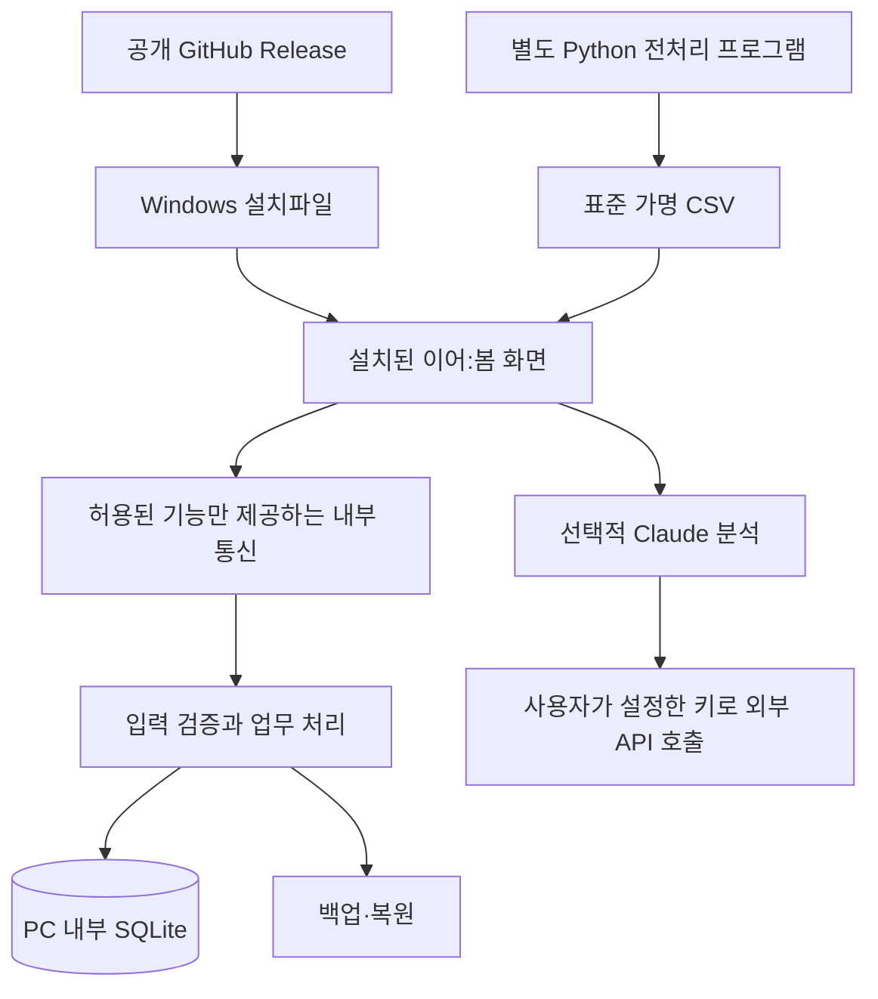

# 이어:봄 Windows 설치형 프로그램 전환 계획

작성 기준: 2026-09-17 / 현재 소스 `18fb942` / 상태: 설계 완료, 데스크톱 구현 전

## 1. 제출 목표와 범위

제출물은 **공개 GitHub Releases에서 설치파일 하나를 다운로드하고, 설치 후 바로 사용할 수 있는 Windows 업무 프로그램**이다. 사용자는 GitHub·ChatGPT·Cloudflare 계정, 개발 도구, 서버 실행, 환경변수 설정을 준비하지 않는다.

사용자가 확정한 대상은 **Windows만 지원**이다. 첫 배포의 대상 아키텍처는 x64로 정한다. Windows 10/11 x64를 검수 대상으로 삼고, 선택한 Electron 버전의 지원 범위와 실제 설치 검증 결과를 확인한 OS만 지원 대상으로 표시한다. 32비트·ARM64·macOS·Linux는 이번 배포에 포함하지 않는다.

Python 전처리 프로그램은 별도로 배포한다. 이어:봄은 전처리 프로그램이 없어도 직접 입력과 표준 CSV로 업무를 시작할 수 있어야 한다. Python 실행이나 전처리 프로그램 설치를 첫 실행 조건으로 만들지 않는다.

여기서 전체 공개의 대상은 프로그램·설치파일·이용 문서이며, 사용자별 업무 데이터는 각 PC에 보관한다. 한 설치본의 DB를 여러 PC가 동시에 공유하는 기능은 첫 버전에 포함하지 않는다.

다운로드할 설치파일의 목표 이름은 `LinkSpring-Setup-1.0.0-x64.exe`다. 이는 앞으로 만들 산출물의 이름이며 현재 설치파일이 생성됐다는 뜻은 아니다. 한 파일은 설치 배포 단위를 의미하며, 설치 후에는 프로그램 폴더와 사용자 데이터 폴더가 생긴다.

## 2. 현재 코드에서 확인한 재사용 범위

| 현재 구성 | 확인한 상태 | 전환 방법 |
| --- | --- | --- |
| `app/page.tsx`, `components/ui/`, `app/globals.css` | React 화면과 세 곳의 API 호출, 로그인 링크 | 화면·스타일을 재사용하고 API 호출을 데스크톱 서비스 호출로 교체 |
| `lib/domain.ts`, `lib/csv.ts` | 후보·날짜·시간·CSV 검증이 TypeScript로 분리됨 | 공통 업무 모듈로 재사용 |
| `lib/state-actions.ts` | 입력 검증과 연결·보류·안내 처리, `D1Database` 의존 | 업무 처리 유지, DB 타입을 자체 인터페이스로 교체 |
| `lib/state-store.ts` | 준비된 SQL, 상태 버전 검사, `db.batch` 원자적 저장 | 로컬 SQLite 어댑터에 같은 보장 구현 |
| `lib/absence.ts` | Claude 호출·응답 검증·규칙 분석 분리 | 메인 프로세스에서 실행, AI는 선택 기능 |
| `lib/server.ts`, `lib/access.ts`, `app/chatgpt-auth.ts` | Cloudflare 환경변수와 ChatGPT 계정 허용 목록 | 데스크톱 실행 경로에서 제외하고 OS 사용자별 로컬 사용으로 전환 |
| `db/schema.ts`, `drizzle/0000~0006` | SQLite 계열 스키마와 충돌 방지 트리거 | 기존 SQL을 검증해 재사용, 앱 시작 시 자동 마이그레이션 |
| `tests/core.test.ts`, `tests/d1.test.ts` | 공통 규칙과 D1 기반 저장 검증 | 공통 검증 유지, DB 통합 검증을 실제 데스크톱 SQLite로 전환 |
| `.openai/`, `worker/`, 기존 Vite 서버 구성 | 웹 배포·개발 서버 실행에 필요 | 설치본의 실행·빌드 의존 경로에서 제외 |

현재 통과한 웹 버전 테스트는 전환 기준선이다. 그 결과만으로 Windows 설치형 검증을 대신하지 않는다.

## 3. 권장 구조: Electron + React + 로컬 SQLite

이번 전환에는 **Electron + Vite/React + better-sqlite3 + electron-builder의 NSIS 설치기**를 권장한다. 현재 핵심 업무 코드가 TypeScript이므로 화면과 업무 규칙을 같은 언어로 유지하고, Cloudflare에 의존하는 입출력 부분을 교체할 수 있다.

Electron은 Chromium과 Node.js를 프로그램에 포함한다. 사용자 PC에 Node.js나 별도 브라우저 실행 환경을 설치하게 하지 않는 배포를 설계할 수 있다. 실행 환경을 포함하는 만큼 설치 용량은 커질 수 있으므로 실제 패키지 용량은 빌드 후 보고한다. [Electron 공식 소개](https://www.electronjs.org/docs/latest/)

앞서 제안한 Tauri도 가능하다. 다만 이 프로젝트에서는 TypeScript 업무 처리의 네이티브 연계 방식과 Windows WebView2 공급을 추가 설계해야 한다. WebView2 오프라인 설치파일을 포함하는 선택지도 있어, Tauri가 반드시 인터넷 설치를 요구하는 것은 아니다. 이번에는 1인 개발의 코드 재사용과 설치 재현성을 우선해 Electron을 기본안으로 정한다. [Tauri Windows 배포 문서](https://v2.tauri.app/distribute/windows-installer/)



설치본은 로컬에 포함된 화면을 표시한다. 사용자 PC에서 웹 개발서버나 HTTP 포트를 열지 않는다. 화면과 업무 처리 사이에는 Electron의 제한된 내부 통신(IPC)을 사용한다.

## 4. 설치와 첫 실행 경험

1. 공개 Release에서 Windows 설치파일 하나를 내려받는다.
2. 한국어 설치 화면으로 설치하고 바탕화면 또는 시작 메뉴에서 실행한다.
3. 앱이 사용자 데이터 폴더와 DB를 자동으로 생성한다.
4. 첫 화면에서 `샘플로 체험` 또는 `내 업무 시작`을 선택한다.
5. 직접 일정·대기자를 입력하거나 CSV 두 종류를 가져온다.
6. 결석 등록 → 후보 비교 → 담당자 확정 → 안내문 복사 → 안내 완료 기록을 수행한다.

첫 실행에 로그인·API 키 입력을 강제하지 않는다. 기관명과 담당자 표시 이름은 기본값으로 시작하고 설정에서 바꿀 수 있다. 병원 명칭과 기관 전용 코드가 다른 비영리단체의 사용을 막지 않도록 일반 서비스 용어로 표시한다.

샘플은 별도 DB에 보관하고 화면에 `체험 데이터`를 표시한다. 샘플의 날짜는 실행일 이후의 업무일로 생성해 이미 지난 일정 때문에 체험이 막히지 않게 한다. 실제 업무 DB에는 샘플을 자동 삽입하지 않는다.

## 5. 화면과 내부 기능의 경계

화면에 `window.linkspring` 형태의 제한된 기능만 제공한다. 화면은 SQL 실행·임의 파일 경로 접근·프로세스 실행 권한을 받지 않는다.

| 기능 | 내부 처리 |
| --- | --- |
| 상태 조회·업무 변경 | 기존 입력 스키마와 업무 검증을 메인 프로세스에서 다시 적용 |
| CSV 선택·미리보기·반영 | 파일 선택 대화상자, 크기 제한, 형식 검증, 확인 후 한 트랜잭션 저장 |
| 문자 분석 | 일정 토큰 검증 후 규칙 분석 또는 선택적 Claude 호출 |
| AI 설정 저장·삭제 | 메인 프로세스에서 키 보호 저장, 화면에는 설정 여부만 반환 |
| 백업·복원 | 사용자가 고른 대상에 검증된 DB 백업·복원 작업만 허용 |
| 도움말·라이선스 | 프로그램에 포함된 문서 표시 |

응답은 성공 데이터와 사용자용 오류 코드를 구분한다. SQL·로컬 절대 경로·원문·API 키를 오류 메시지로 반환하지 않는다.

`nodeIntegration: false`, `contextIsolation: true`, `sandbox: true`를 기본으로 하고, IPC 발신 창·프레임을 확인한다. 프로그램 화면 안에 외부 사이트를 열지 않고 새 창·임의 탐색을 제한한다. 배포된 로컬 화면에 맞는 콘텐츠 보안 정책을 적용한다. [Electron 보안 가이드](https://www.electronjs.org/docs/latest/tutorial/security), [Context Isolation](https://www.electronjs.org/docs/latest/tutorial/context-isolation)

## 6. 로컬 데이터와 운영 처리

저장 위치는 설치 폴더와 분리한 Windows 사용자별 로컬 폴더로 고정한다. 예: `%LOCALAPPDATA%\LinkSpring\data\linkspring.sqlite`. 개발용·체험용·실사용 DB 경로를 서로 분리하고 앱의 데이터 폴더 열기 기능을 제공한다. 설치 경로·현재 작업 폴더·소스 저장소를 기준으로 DB를 만들지 않는다.

- 앱은 하나의 인스턴스만 실행하며 데이터 변경 요청을 순서대로 처리한다.
- 기존 상태 버전 비교와 충돌 가드, 변경과 감사 로그의 동시 저장을 유지한다.
- 로컬 어댑터의 `batch`는 모든 SQL이 성공할 때만 커밋하고 실패 시 전체 롤백한다. 동기 SQLite 트랜잭션 안에서 비동기 작업을 기다리지 않는다.
- SQLite의 외래 키 검사·잠금 대기 시간·저널 설정을 명시하고 디스크 부족·권한 거부·잠금 오류를 한국어로 안내한다.
- 네트워크 드라이브나 파일 동기화 폴더의 DB를 여러 PC가 함께 여는 방식을 지원하지 않는다.
- Windows 사용자 계정을 데이터 접근의 기본 경계로 사용한다. 같은 Windows 계정을 공유하면 앱 데이터도 공유되며, 담당자 표시 이름은 본인 인증 수단이 아니다.
- SQLite 파일 자체의 암호화를 구현했다고 표시하지 않는다. 가명 데이터도 업무 데이터로 취급하며 공개 Release에 포함하지 않는다.

백업은 SQLite의 일관된 스냅샷 기능을 사용한다. 실행 중인 DB 파일 하나를 단순 복사하는 방식은 채택하지 않는다. [SQLite Online Backup API](https://www.sqlite.org/backup.html)

사용자가 `백업 저장`을 선택하면 DB·앱/스키마 버전·검증 정보를 하나의 백업 파일로 내보낸다. API 키와 원문 CSV는 제외한다. 복원 전 현재 DB를 자동 백업하고, 임시 위치에서 형식·버전·무결성 검사를 마친 뒤 교체한다. 실패하면 기존 DB를 유지한다. 백업 파일에는 업무 데이터가 들어 있음을 저장 화면에 표시한다.

업데이트는 같은 앱 식별자와 데이터 경로를 유지한다. 새 버전 첫 실행 전 자동 백업을 만들고 미적용 마이그레이션만 적용한다. 마이그레이션 실패 시 변경을 취소하고 복구 방법을 안내한다. 구버전 앱이 더 새로운 DB를 만나면 무리하게 열지 않는다. 제거 프로그램은 기본적으로 사용자 데이터를 보존하며, 전체 데이터 삭제는 별도 확인 절차로 제공한다.

## 7. 별도 Python 전처리 프로그램과의 연계

연계는 **파일 규격**으로 고정한다. 이어:봄이 Python을 설치하거나 실행하고, 전처리 프로그램이 이어:봄 DB를 직접 수정하는 구조는 사용하지 않는다.

```text
기관 원본 자료
  → 별도 전처리 프로그램: 가명화·열 변환·검증
  → 대기 명단 CSV + 날짜별 시간표 CSV
  → 이어:봄: 미리보기·재검증·사용자 확인
  → 로컬 DB에 반영
```

필수 열은 현재 `lib/csv.ts`와 호환되도록 유지한다. 출력은 UTF-8 BOM 포함을 권장하며 기존 EUC-KR 읽기도 유지한다. 상세 규격은 [전처리 CSV 연계규격 v1](docs/전처리_CSV_연계규격_v1.md)에 정의한다.

같은 대상자는 재추출해도 같은 가명 ID를 사용해야 한다. 이름·생년월일에서 매번 짧은 해시를 만들지 않고, 전처리 프로그램 또는 기관이 유지하는 대응표로 안정적인 ID를 발급한다. 대응표와 원문 파일은 이어:봄 배포물이나 외부 AI로 전달하지 않는다.

명단 파일과 시간표 파일은 각각 별도의 반영 단위다. 각 파일의 반영은 전체 성공 또는 전체 취소이며, 서로 다른 파일까지 하나의 트랜잭션이라고 표시하지 않는다. 오류는 행 번호·열 이름·수정 방법으로 안내한다.

전처리 프로그램을 쓰지 않는 사용자는 프로그램의 직접 등록 화면과 내장 CSV 양식을 이용한다. 이를 위해 현재 CSV 중심인 서비스 일정에 직접 추가·수정 화면을 보완한다. 등록·연결된 회기를 훼손하는 일정 수정은 차단한다.

## 8. AI 기능의 제공 방식

**API 키 없이 후보 검색·배정·기록을 완주할 수 있어야 한다.** 기본은 직접 입력과 규칙 기반 일정 분석이며, 이는 생성형 AI라고 표시하지 않는다. 인터넷이 끊겨도 핵심 업무는 계속 동작한다.

Claude를 사용하려는 사람만 설정에서 자신의 키와 지원 모델을 등록한다. 키는 메인 프로세스에서 Windows의 보호 저장 기능을 이용해 보관하고 백업·로그·설치파일에 넣지 않는다. Windows에서 Electron `safeStorage`는 DPAPI를 이용하며, 같은 OS 사용자 권한으로 실행되는 다른 프로그램까지 완전히 방어하는 수단은 아니다. [safeStorage 공식 문서](https://www.electronjs.org/docs/latest/api/safe-storage)

외부 전송은 사용자가 확인한 일정 토큰에 한정한다. 모델 누락·호출 실패·시간 초과·결제/한도 문제는 규칙 분석으로 전환하고 처리 방식을 표시한다. 공용 API 키나 제작자 개인 키를 설치본에 내장하지 않는다.

제출 문서에는 `키 없이 핵심 업무 이용 가능 / Claude 보조 기능은 본인 API 설정과 인터넷 필요`를 명시한다. AI 사용 설명과 이용 절차를 요구하는 제출 양식을 근거로, 규칙 계산을 AI 추천이라고 과장하지 않는다.

주최 측이 **AI 기능 자체도 별도 키 없이 누구나 실행할 것**을 추가 요구하는지는 현재 제공된 템플릿만으로 확인되지 않는다. 그 요구가 있다면 로컬 모델 포함 또는 비용을 운영자가 부담하는 별도 중계 서비스가 필요하며, 설치 용량·성능·비용 범위가 달라진다. 현재 계획은 무설정 핵심 업무 + 선택적 Claude를 기준으로 한다.

## 9. 변경할 파일 구성

아래는 목표 경로이며 아직 생성된 구현 파일 목록은 아니다.

```text
desktop/
  main.ts                    # 창·단일 실행·데이터 경로·앱 생명주기
  preload.ts                 # 제한된 기능 연결
  ipc.ts                     # 발신자·입력 검사와 작업 처리
  database.ts                # SQLite 연결·설정·초기화
  sqlite-adapter.ts          # 공통 DB 인터페이스 구현
  migrations.ts              # 마이그레이션·버전 검사
  backup.ts                  # 백업·복원
  ai-settings.ts             # 키 보호 저장·삭제
renderer/
  main.tsx                   # React 시작점
  App.tsx                    # 기존 화면 이관
  desktop-client.ts          # 내부 기능 호출
shared/
  contracts.ts               # 화면/메인 공통 요청·응답
lib/
  database-port.ts           # D1 전역 타입을 대신할 최소 계약
  domain.ts                  # 기존 후보·시간 규칙
  csv.ts                     # 기존 형식 검증
  state-actions.ts           # DB 계약을 사용하는 업무 처리
  state-store.ts             # DB 계약을 사용하는 조회·저장
  absence.ts                 # 규칙·Claude 구조화
electron-builder.yml         # Windows NSIS 패키징
vite.desktop.config.ts       # 설치본에 포함할 정적 화면 빌드
.github/workflows/windows-release.yml
```

`app/page.tsx`의 HTTP 호출을 먼저 `desktop-client`와 대응되는 서비스 경계로 분리한다. 새 앱에서는 Next/Vinext의 서버 라우트와 로그인 링크를 사용하지 않는다. 로컬 화면에 필요한 글꼴·아이콘·샘플·도움말은 설치본에 포함해 CDN 접근을 필수 조건에서 제거한다.

기존 웹 버전은 Git 이력으로 보존하고 별도 전환 브랜치에서 작업한다. 최종 설치용 패키지의 의존성은 데스크톱 실행에 필요한 항목으로 정리한다. `private: true`인 npm 설정은 패키지의 npm 게시 여부에 관한 것으로, GitHub 저장소 공개 설정을 대신하지 않는다.

## 10. 설치파일 제작과 GitHub 공개

패키지는 다운로드 이후 설치 중 추가 구성요소를 받지 않는 **완전한 NSIS 설치파일**로 만든다. 다운로드형 `nsis-web`은 사용하지 않는다. 사용자별 설치를 기본으로 하고 관리자 권한 상승이 불필요한 구성을 검증한다. 기관 PC의 실행 통제 정책에 따른 차단까지 없다고 보장하지 않는다. [electron-builder NSIS 문서](https://www.electron.build/v26/docs/nsis/)

better-sqlite3 네이티브 모듈은 선택한 Electron 버전과 Windows x64에 맞게 빌드해 포함한다. 개발자 Mac에서 테스트한 바이너리를 Windows 설치본에 복사하지 않는다. Windows 빌드 작업에서 재빌드와 설치본 실행 검증을 수행한다. [Electron 네이티브 모듈 문서](https://www.electronjs.org/docs/latest/tutorial/using-native-node-modules)

CI 흐름은 테스트 → Windows 빌드 → 설치·기동 검사 → 서명 → 체크섬 생성 → Release 초안 첨부로 구성한다. 외부 PR에서 서명 자격증명을 사용할 수 없게 하고, 승인된 태그/커밋의 배포 작업에만 권한을 준다. 실제 다운로드한 서명된 최종 파일을 별도 깨끗한 Windows 환경에서 다시 검수한 뒤 공개한다.

목표 Release 구성:

| 파일 | 목적 |
| --- | --- |
| `LinkSpring-Setup-1.0.0-x64.exe` | 일반 사용자가 받는 설치파일 |
| `SHA256SUMS.txt` | 게시된 파일과 다운로드 파일 비교 |
| `빠른시작.pdf` 또는 공개 사용 안내 | 설치·체험·CSV·백업 방법 |
| 릴리스 설명 | 지원 OS, 버전, AI 선택 사항, 전처리 프로그램 링크 |
| 소스코드·LICENSE·서드파티 고지 | 공개 이용·재배포 범위와 사용 라이브러리 고지 |

앱 안에도 오프라인 도움말과 샘플을 포함한다. 일반 사용자에게 GitHub가 자동 생성하는 `Source code (zip)` 대신 설치파일을 내려받도록 안내한다. Releases는 버전 태그와 바이너리 첨부물을 제공하는 배포 단위다. [GitHub Releases 문서](https://docs.github.com/en/repositories/releasing-projects-on-github/about-releases)

배포 대상 저장소는 사용자가 지정한 `hamhyeonggwang/linkspring_1.0`이다. 저장소·Release·첨부파일이 로그아웃 상태에서도 내려받아지는지 최종 확인한다. 현재 저장소의 공개 여부는 이번 설계에서 변경하지 않는다.

Windows 코드 서명은 설치 신뢰도와 배포 검수 항목에 포함한다. 서명 수단·발급자·자격증명은 확보 여부를 확인해야 하며, 기관 정책·파일 평판 등에 따라 경고가 남을 수 있다. 보안 설정 해제를 정상 설치 절차로 제시하지 않는다. 서명 없는 시험판을 정식 서명 배포판이라고 표시하지 않는다. [Electron 코드 서명 문서](https://www.electronjs.org/docs/latest/tutorial/code-signing)

프로젝트 자체의 이용·수정·재배포 허용 범위를 정한 LICENSE를 추가한다. MIT를 후보로 제안하되 기관의 공개 범위와 기여 코드 권한을 확인해 확정한다. 기존 라이브러리 라이선스도 함께 배포한다.

## 11. 구현 순서와 단계별 종료 기준

| 단계 | 작업 | 종료 기준 |
| --- | --- | --- |
| 1. 설치 가능성 검증 | 최소 Electron 창 + SQLite 한 건 저장 + Windows 설치기 | 개발 도구 없는 Windows에서 설치·기동·종료·재실행 성공 |
| 2. 업무 흐름 이관 | 공통 DB 계약, 화면 내부 통신, 후보·CSV·확정·감사 로그 | 네트워크를 끄고 실제 업무 흐름 한 사이클 완료 |
| 3. 일반 사용자 사용성 | 샘플 DB, 직접 일정 입력, 한국어 오류, 도움말 | 처음 쓰는 사람이 샘플을 시작하고 CSV 반영까지 수행 |
| 4. 데이터 유지·정정 | 백업·복원·업데이트 마이그레이션, 연결 취소와 감사 기록 | 업그레이드·복원·잘못된 연결 정정 뒤 상태와 로그 일치 |
| 5. 선택적 AI | 키 설정·삭제·보호 저장, 메인 프로세스 분석 | 키 없이 핵심 기능 정상, 키가 있을 때만 실제 Claude 호출 |
| 6. 제출 검수 | 서명·패키지 검사·문서·공개 다운로드 | 아래 합격 기준 충족 후 Release와 제출 문서 링크 확정 |

4단계의 연결 취소는 잘못된 연결을 되돌리기 위한 업무 기능이다. 이미 안내한 회기는 담당자 재연락 필요를 표시하고, 최근 연결 값·후보 제외 상태·감사 로그를 같은 트랜잭션에서 갱신한다. 기존 감사 로그를 삭제해 수정 흔적을 지우지 않는다.

실제 Windows 실행을 1단계부터 확인한다. 마지막에 설치기를 붙이는 방식으로 진행하면 네이티브 모듈·경로·권한 오류를 뒤늦게 발견할 수 있다. 일정은 Windows 검수 환경과 서명 수단이 확인된 후 산정한다.

## 12. 공모전 제출 완료 기준

- [ ] 로그아웃한 브라우저에서 공개 설치파일 다운로드 가능
- [ ] Python·Node.js·Git·개발 도구가 없는 새 Windows 사용자 환경에서 설치 성공
- [ ] 다운로드 이후 인터넷을 끊고 첫 실행 및 핵심 업무 완료
- [ ] 별도 계정·서버 주소·환경변수·API 키 없이 대기자·일정 등록 가능
- [ ] 100명 가상 명단과 시간표 가져오기, 미리보기, 오류 행 안내 확인
- [ ] 날짜·시간·서비스·활성 상태·최근 연결 기준과 중복 배정 차단 유지
- [ ] 저장 실패·중복 클릭·오래된 화면·강제 종료에서 가짜 성공과 부분 저장 방지
- [ ] 재실행 후 데이터 유지, 백업·복원·업데이트 후 건수 및 감사 기록 일치
- [ ] Python 전처리 도구의 실제 출력 샘플과 CSV 연계규격 호환 확인
- [ ] 샘플과 업무 DB 분리, 기본 데이터에 실제 기관 정보·실명·키 없음
- [ ] 설치된 앱의 IPC 발신자 검증·입력 검증·화면 권한 제한 확인
- [ ] Claude 미설정·오프라인·시간 초과·오류 시 핵심 업무 계속 가능
- [ ] `.env.local`, `.wrangler`, 실제 DB·백업·키·개발 로그가 설치파일에 포함되지 않음
- [ ] 한글 사용자 이름·한글/공백 파일 경로·일반 사용자 권한에서 정상 동작
- [ ] 제거·재설치 및 업데이트가 사용자 데이터를 임의 삭제하지 않음
- [ ] 서명 상태·지원 OS·프로젝트 라이선스·AI 조건을 제출 문서에 정확히 기재
- [ ] 개발서버가 아닌 실제 다운로드한 최종 설치파일로 검수 완료

최종 제출 문서의 실행 링크는 공개 Release 다운로드 링크로 바꾸고, 사용자 가이드에서 `npm install`, 개발서버, D1·ChatGPT 로그인 설정을 제거한다. 기관 소개·문제 정의·1인 팀 정보는 유지한다. 실제 Windows 검수 전에는 설치형 전환이 완료됐다고 기재하지 않는다.

## 13. 구현 전 확인 사항

Windows 전용 지원은 확정됐다. 설계를 막지 않고 진행할 수 있는 기본안은 x64·로컬 단독 사용·오프라인 핵심 기능·선택적 Claude다. 배포 완료 시점까지는 Windows 검수 환경, 코드 서명 수단, 프로젝트 LICENSE, 주최 측의 AI 무설정 실행 요구 여부를 확인해야 한다.

이 문서는 전환 계획이며, 기존 실행 코드를 교체하거나 설치파일을 빌드·게시한 결과 보고서가 아니다.
